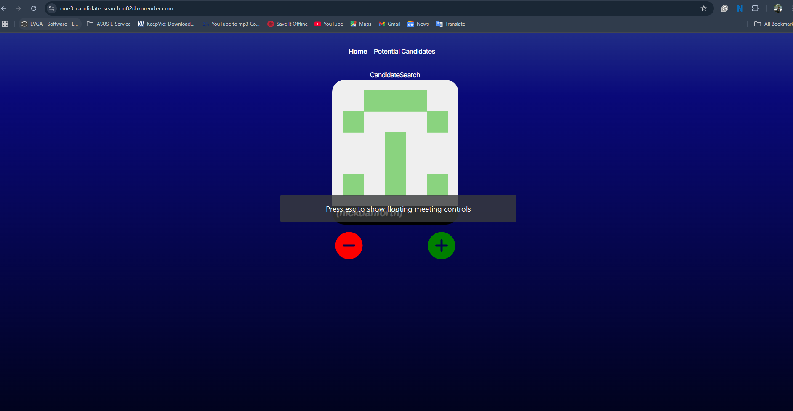

# CandidateSearch

A clean and responsive GitHub candidate viewer built with **React** and **TypeScript**. This app helps you explore potential developers from GitHub, presenting them in a modern UI with theme toggling, pagination, and plans for filtering and sorting features.

🔗 **Live Demo**: [https://one3-candidate-search-u82d.onrender.com](https://one3-candidate-search-u82d.onrender.com)

---

## 📸 Screenshots

Home & Candidate View Interface:

> The app features a fixed top Navbar and collapsible SideNav, with centered candidate components and interactive plus/minus controls.

---

## ✨ Features

- 🔍 **GitHub API Integration** – View candidate profiles in real-time
- 🌙 **Light/Dark Mode** – Toggle themes with preserved readability
- 💾 **Local Storage** – Candidate data is saved across sessions
- 🧹 **Empty State Handling** – Clean fallback UI when no candidates are present
- 📦 **Fixed Layout** – Navbar and SideNav are always visible
- 📱 **Responsive Design** – Works on all screen sizes
- 🔢 **Pagination** – Paginated 3x3 grid display
- 🧠 **UI/UX Enhancements** – Hover effects, animations, and themed icons
- 🚧 **Planned**: Sorting and filtering by language, followers, activity

---

## 🛠️ Tech Stack

- **Framework**: React + TypeScript
- **Styling**: CSS Modules (or Tailwind if used)
- **Icons**: Lucide + React Icons
- **API**: GitHub REST API
- **Deployment**: Render.com

---

## 📁 Project Structure (Simplified)